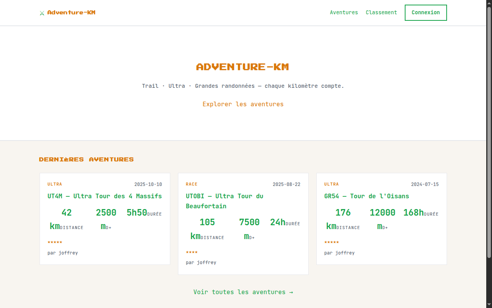
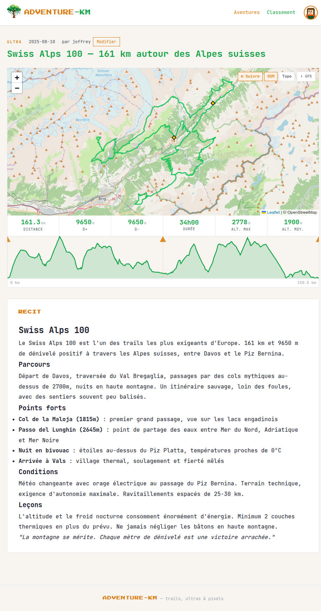
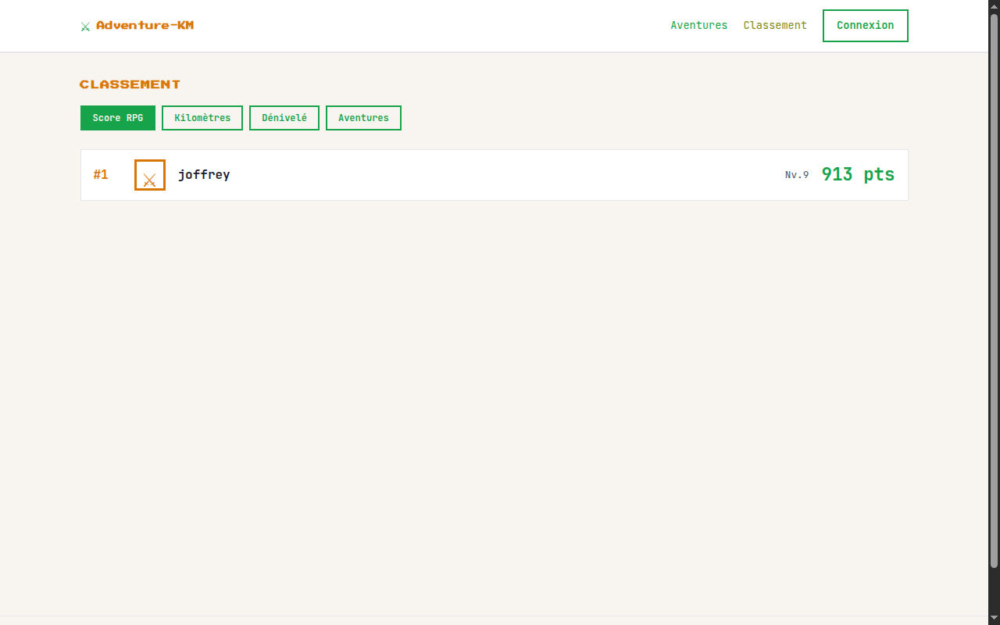
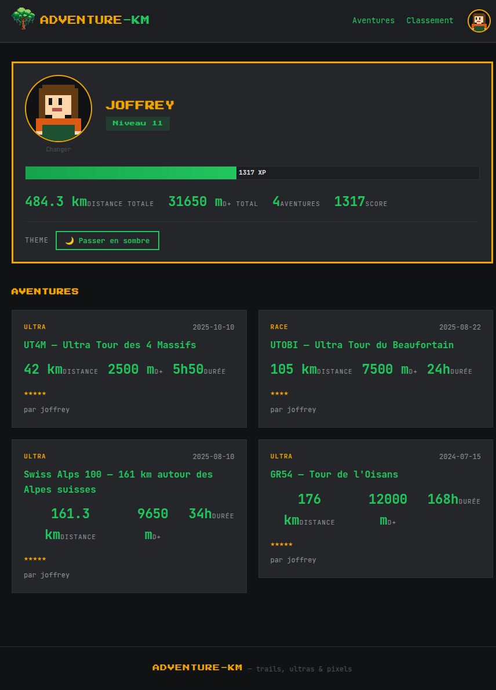

# Adventure-KM

Journal de bord pour trail runners et randonneurs. Publiez vos sorties avec stats GPX, photos, équipement, et suivez votre progression sur un classement.



## Fonctionnalités

- **Aventures** — création, édition, publication avec contenu Markdown
- **Import GPX** — calcul automatique distance, D+/D-, durée, altitude max/min
- **Carte interactive** — visualisation du tracé GPS (Leaflet), bascule OSM / Topo, suivi curseur
- **Profil d'élévation** — courbe interactive avec tooltip, sélection de segment (distance/D+/D-), waypoints GPX
- **Téléchargement GPX** — export direct depuis la page aventure
- **Photos** — jusqu'à 5 photos par aventure
- **Classement** — tri par score, kilomètres, dénivelé ou nombre d'aventures
- **Profil** — statistiques cumulées, barre de progression, niveau RPG, avatar pixel art
- **Thème clair/sombre** — persisté par compte utilisateur
- **Invitations** — accès sur invitation uniquement





## Stack

| Couche | Technologie |
|--------|-------------|
| Backend | Java 17, Spring Boot 4, Spring Security (JWT) |
| Base de données | PostgreSQL (prod), H2 in-memory (dev) |
| Migrations | Flyway |
| Frontend | Angular 21, SSR, Signals |
| Reverse proxy | Nginx |
| Conteneurisation | Docker Compose |

---

## Démarrage rapide

### Prérequis

- Docker + Docker Compose
- (Développement) Java 17, Node.js 20

### Production locale (Docker)

```bash
# 1. Cloner
git clone <repo-url>
cd adventure-km

# 2. Configurer les secrets
cp .env.example .env
# Éditer .env : changer DB_PASSWORD et JWT_SECRET

# 3. Lancer
docker-compose up --build -d
```

L'app est disponible sur **http://localhost**.

Compte par défaut (seed) : `joffrey` / `123456`

```bash
# Arrêter (données conservées)
docker-compose down

# Arrêter et supprimer les données
docker-compose down -v

# Voir les logs
docker-compose logs -f

# Mettre à jour après un git pull
docker-compose up --build -d
```

---

### Développement

**Backend**

```bash
cd adventure-km-backend
./mvnw spring-boot:run -Dspring-boot.run.profiles=dev
# Démarre sur http://localhost:8080
# H2 console : http://localhost:8080/h2-console
# JDBC URL : jdbc:h2:mem:adventurekm / user: sa / password: (vide)
```

**Frontend**

```bash
cd adventure-km-frontend
npm install
npx ng serve
# Démarre sur http://localhost:4200 (proxy vers backend :8080)
```

---

## Variables d'environnement

| Variable | Description | Défaut |
|----------|-------------|--------|
| `DB_PASSWORD` | Mot de passe PostgreSQL | `changeme` |
| `JWT_SECRET` | Clé de signature JWT (min. 256 bits) | valeur de dev |

---

## Gestion des comptes

L'inscription est protégée par token d'invitation. Pour créer un token :

```
POST /api/admin/invitations
Authorization: Bearer <token-admin>
{ "note": "Pour untel" }
```

L'admin par défaut est le compte seed (`joffrey`, rôle `ADMIN`).

---

## Tests

```bash
cd adventure-km-backend
./mvnw test
```

---

*Projet personnel servant de terrain de jeu pour progresser en développement fullstack (Spring Boot côté backend, Angular côté frontend), et explorer les capacités de [Claude Code](https://claude.ai/code) en assistance au développement.*
